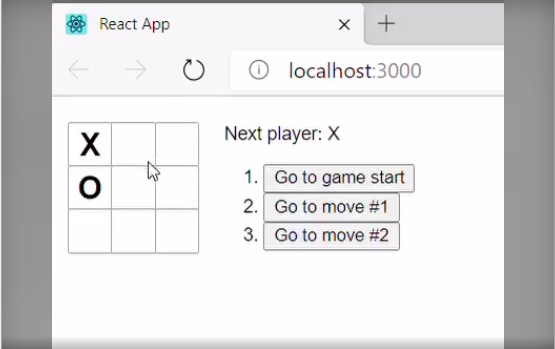

# Tic-Tac-Toe-React

One of the first few React projects I will be taking on.
This project is a a simple start on my world of React using a game from our childhood - The classic Tic-Tac-Toe

## Motivation

Beginning is the hardest part they say, and so with this project I have begun my very first Recat application. Initially I felt this is a small accomplishment but after the project was complete, I had confidence that I would be able to take on upcoming projects that include React without feeling intimidated.

## Screenshots



## Tech/Frameworks Used
React, HTML, CSS, Javascript

## Features
* Storing past moves and ability to go back to any of them
* Determining who wins

## Code Example
Function to calculate the history of moves

``` handleClick(i) {
      const history = this.state.history.slice(0, this.state.stepNumber + 1);
      const current = history[history.length - 1];
      const squares = current.squares.slice();
      if (calculateWinner(squares) || squares[i]) {
        return;
      }
      squares[i] = this.state.xIsNext ? "X" : "O";
      this.setState({
        history: history.concat([
          {
            squares: squares
          }
        ]),
        stepNumber: history.length,
        xIsNext: !this.state.xIsNext
      });
    }
    
```

## Credits
**©Ashok Srinivasan| 2020**
